# FinanceApp - Contexto del Proyecto

## Resumen del Proyecto

**FinanceApp** es una aplicación móvil de rastreo de gastos y gestión financiera específicamente diseñada para el mercado mexicano. Combina una app móvil en React Native con un backend en Python FastAPI, con capacidades avanzadas de OCR para escanear recibos y fundamentos para insights financieros con machine learning.

**Propósito:**
- Rastreo de gastos mediante entrada manual o escaneo de recibos (OCR)
- Categorización inteligente e insights financieros
- Gestión colaborativa de gastos mediante proyectos con múltiples usuarios
- Características específicas para México (validación de RFC, cálculo de IVA, deducibilidad fiscal)
- Machine learning para predicciones y detección de anomalías

**Mercado objetivo:** Usuarios mexicanos, freelancers, pequeños negocios

---

## Stack Tecnológico

### Frontend (Aplicación Móvil)
- **Framework:** React Native (v0.81.5) con Expo (v54)
- **Navegación:** Expo Router (v6) - Enrutamiento basado en archivos
- **State Management:** Zustand (v5) con persistencia en AsyncStorage
- **Data Fetching:** TanStack React Query (v5) + Supabase Client
- **UI:** Sistema de diseño personalizado con estética minimalista
- **Cámara/Fotos:** expo-camera (v17), expo-image-picker (v17)
- **Gráficas:** react-native-chart-kit (v6), react-native-svg (v15)

### Backend
- **Framework:** FastAPI (Python)
- **Base de Datos:** Supabase (PostgreSQL con auth y storage)
- **OCR:** Google Document AI (Receipt Parser)
- **Validación:** Pydantic con validación de email
- **Auth:** python-jose (JWT), passlib (bcrypt)

### Machine Learning (En Progreso)
- **Categorización:** XGBoost
- **Predicciones:** Prophet
- **Detección de Anomalías:** Scikit-learn (Isolation Forest)

### Servicios
- **DB y Auth:** Supabase
  - URL: https://tzbavdowvcwhbilzvdwi.supabase.co
  - Project Ref: tzbavdowvcwhbilzvdwi
  - Auth: JWT con Row Level Security (RLS)

---

## Estructura del Proyecto

```
/Users/danielgalvans/Desktop/FinanceAPP/
├── mobile-app/                    # Aplicación móvil React Native
│   ├── app/                       # Páginas Expo Router
│   │   ├── _layout.js            # Layout raíz con tab bar
│   │   ├── index.js              # Pantalla de inicio
│   │   ├── expenses.js           # Lista de gastos
│   │   ├── add-expense.js        # Agregar gasto
│   │   ├── cards.js              # Tarjetas/Presupuesto
│   │   ├── profile.js            # Perfil
│   │   ├── insights.js           # Analytics/Insights
│   │   └── ...                   # Otras rutas
│   ├── src/
│   │   ├── components/           # Componentes reutilizables
│   │   │   ├── categories/       # Componentes de categorías
│   │   │   ├── charts/           # Componentes de gráficas
│   │   │   ├── comments/         # Sistema de comentarios
│   │   │   ├── common/           # Componentes compartidos
│   │   │   ├── transactions/     # Tarjetas de transacciones
│   │   │   └── ui/               # Primitivos UI
│   │   ├── config/               # Configuración
│   │   │   ├── env.js           # Variables de entorno
│   │   │   └── supabase.js      # Cliente Supabase
│   │   ├── constants/            # Constantes del sistema de diseño
│   │   │   ├── colors.js        # Paleta de colores
│   │   │   ├── styling.js       # Sombras, espaciado, tipografía
│   │   │   └── index.js         # Exportaciones centralizadas
│   │   ├── hooks/                # React hooks personalizados
│   │   ├── screens/              # Componentes de pantalla
│   │   ├── services/             # Servicios API
│   │   │   ├── dataService.js   # Operaciones Supabase
│   │   │   ├── apiService.js    # Llamadas API backend
│   │   │   ├── ocrService.js    # Integración OCR
│   │   │   └── index.js
│   │   ├── store/                # State management Zustand
│   │   │   ├── dataStore.js     # Store de categorías/proyectos
│   │   │   └── expenseStore.js  # Store de gastos
│   │   └── utils/                # Funciones utilidad
│   │       ├── devHelpers.js    # Herramientas de desarrollo
│   │       ├── formatters.js    # Formateadores de datos
│   │       └── validators.js
│   ├── .env                      # Variables de entorno
│   └── package.json              # Dependencias
│
├── backend/                       # Backend Python FastAPI
│   ├── app/
│   │   ├── routers/              # Endpoints API
│   │   │   ├── ocr.py           # Endpoints OCR
│   │   │   └── expenses.py      # CRUD de gastos
│   │   ├── schemas/              # Modelos Pydantic
│   │   ├── services/             # Lógica de negocio
│   │   │   ├── ocr_service.py   # Integración Document AI
│   │   │   ├── ocr_postprocessor.py # Procesamiento específico MX
│   │   │   └── storage_service.py
│   │   └── utils/                # Funciones utilidad
│   │       └── mexico_utils.py  # RFC, IVA, deducibilidad
│   ├── main.py                   # Punto de entrada FastAPI
│   ├── requirements.txt          # Dependencias Python
│   ├── database_schema.sql       # Schema PostgreSQL completo
│   └── .env                      # Variables de entorno
│
└── .claude/                       # Contexto para Claude Code
    └── context.md                # Este archivo
```

---

## Flujo de Navegación y Estructura de la App

```mermaid
flowchart TD
    Start["Primera vez"] --> Onboarding["Onboarding/Tutorial"]
    Onboarding --> Auth["Login/Registro"]
    Auth --> Setup["Setup Inicial<br/>Proyectos & Categorías"]
    Setup --> A

    A["App Root"] --> B["Custom Tab Bar"]
    A --> Search["🔍 Búsqueda Global"]
    A --> Notif["🔔 Notificaciones"]

    B --> C["🏠 Home"]
    B --> D["📊 Gastos"]
    B --> E["➕ Agregar"]
    B --> F["📈 Insights"]
    B --> G["👤 Perfil"]

    %% ==================== HOME ====================
    C --> C0["Selector de Proyecto"]
    C0 --> C0A["Cambiar Proyecto"]
    C0 --> C0B["⚙️ Gestionar Proyectos"]

    C0B --> C0B1["Crear Proyecto"]
    C0B --> C0B2["Editar Proyecto"]
    C0B --> C0B3["Archivar Proyecto"]
    C0B --> C0B4["👥 Colaboradores"]
    C0B --> C0B5["⚙️ Configuración"]

    C0B4 --> C0B4A["Ver Colaboradores"]
    C0B4 --> C0B4B["✉️ Invitar"]
    C0B4B --> C0B4B1["Por Email"]
    C0B4B --> C0B4B2["Link Compartible"]
    C0B4B --> C0B4B3["QR Code"]
    C0B4B --> C0B4B4["Desde Contactos"]
    C0B4B1 & C0B4B2 & C0B4B3 & C0B4B4 --> C0B4C["Asignar Rol"]
    C0B4C --> C0B4C1["👑 Admin"]
    C0B4C --> C0B4C2["✏️ Editor"]
    C0B4C --> C0B4C3["👁️ Viewer"]
    C0B4C --> C0B4C4["✅ Aprobador"]
    C0B4 --> C0B4D["Gestionar Roles"]
    C0B4 --> C0B4E["Ver Actividad"]

    C0B5 --> C0B5A["Aprobaciones"]
    C0B5 --> C0B5B["Límites"]
    C0B5 --> C0B5C["Notificaciones"]

    C --> C00["Quick Actions"]
    C00 --> C00A["Agregar Gasto"]
    C00 --> C00B["Escanear Ticket"]
    C00 --> C00C["Ver Presupuesto"]

    C --> C1["Balance Card"]
    C --> C2["Resumen por Categoría"]
    C --> C3["Transacciones Recientes"]
    C3 --> C4["Ver Detalle"]
    C4 --> C4A["Editar"]
    C4 --> C4B["Eliminar"]
    C4 --> C4C["Duplicar"]
    C4 --> C4D["💬 Comentarios"]
    C4 --> C4E["Compartir"]

    C --> C5["👥 Actividad Colaboradores"]
    C --> C6["📊 Mini Dashboard"]

    %% ==================== GASTOS ====================
    D --> D1["Lista Completa"]
    D --> D2["🔍 Buscar"]
    D --> D3["🎛️ Filtros"]
    D3 --> D3A["Por Fecha"]
    D3 --> D3B["Por Categoría"]
    D3 --> D3C["Por Monto"]
    D3 --> D3D["Por Usuario"]
    D3 --> D3E["Por Proyecto"]

    D --> D4["📅 Vista Calendario"]
    D --> D5["Agrupar/Ordenar"]
    D --> D6["Ver Detalle"]
    D6 --> D6A["Editar"]
    D6 --> D6B["Eliminar"]
    D6 --> D6C["Comentarios"]

    D --> D7["📤 Exportar"]
    D7 --> D7A["Excel"]
    D7 --> D7B["PDF"]
    D7 --> D7C["Compartir"]

    D --> D8["⚙️ Gestionar Categorías"]
    D8 --> D8A["Crear Categoría"]
    D8 --> D8B["Editar Categoría"]
    D8 --> D8C["Eliminar Categoría"]

    %% ==================== AGREGAR ====================
    E --> E1["Manual"]
    E --> E2["Escanear OCR"]
    E --> E3["Template"]
    E --> E4["Recurrente"]

    E1 & E2 & E3 & E4 --> E5["Guardar"]
    E5 --> E5A{"¿Requiere<br/>aprobación?"}
    E5A -->|Sí| E5B["Enviar a Aprobación"]
    E5A -->|No| E5C["Guardar"]
    E5B --> E5D["Notificar"]

    %% ==================== INSIGHTS (NUEVA SECCIÓN) ====================
    F --> F1["📊 Dashboard General"]
    F1 --> F1A["Balance Total"]
    F1 --> F1B["Tendencias"]
    F1 --> F1C["Comparativas"]

    F --> F2["📈 Gráficas"]
    F2 --> F2A["Por Categoría"]
    F2 --> F2B["Por Tiempo"]
    F2 --> F2C["Por Proyecto"]

    F --> F3["💰 Presupuestos"]
    F3 --> F3A["Crear Presupuesto"]
    F3 --> F3B["Ver Progreso"]
    F3 --> F3C["Alertas"]

    F --> F4["🎯 Metas Financieras"]
    F4 --> F4A["Crear Meta"]
    F4 --> F4B["Seguimiento"]
    F4 --> F4C["Logros"]

    F --> F5["📋 Reportes"]
    F5 --> F5A["Mensual"]
    F5 --> F5B["Anual"]
    F5 --> F5C["Por Proyecto"]
    F5 --> F5D["Personalizado"]

    F --> F6["✅ Aprobaciones"]
    F6 --> F6A["Pendientes"]
    F6 --> F6B["Historial"]
    F6A --> F6A1["Aprobar"]
    F6A --> F6A2["Rechazar"]
    F6A --> F6A3["Solicitar Info"]

    %% ==================== PERFIL (LIMPIO) ====================
    G --> G1["👤 Info Personal"]
    G1 --> G1A["Editar Nombre"]
    G1 --> G1B["Cambiar Avatar"]
    G1 --> G1C["Email"]

    G --> G2["🔐 Seguridad"]
    G2 --> G2A["Cambiar Contraseña"]
    G2 --> G2B["Autenticación 2FA"]
    G2 --> G2C["Sesiones Activas"]

    G --> G3["🔔 Notificaciones"]
    G3 --> G3A["Push"]
    G3 --> G3B["Email"]
    G3 --> G3C["Por Tipo"]

    G --> G4["🎨 Apariencia"]
    G4 --> G4A["Tema Claro/Oscuro"]
    G4 --> G4B["Color Acento"]

    G --> G5["🌐 Región"]
    G5 --> G5A["Idioma"]
    G5 --> G5B["Moneda"]
    G5 --> G5C["Formato Fecha"]
    G5 --> G5D["Zona Horaria"]

    G --> G6["👥 Invitaciones"]
    G6 --> G6A["Pendientes"]
    G6 --> G6B["Proyectos Compartidos"]
    G6A --> G6A1["Aceptar"]
    G6A --> G6A2["Rechazar"]

    G --> G7["💾 Data & Privacidad"]
    G7 --> G7A["Exportar Datos"]
    G7 --> G7B["Backup"]
    G7 --> G7C["Restaurar"]
    G7 --> G7D["Borrar Cuenta"]

    G --> G8["❓ Ayuda"]
    G8 --> G8A["Tutorial"]
    G8 --> G8B["FAQ"]
    G8 --> G8C["Contacto"]
    G8 --> G8D["Términos"]
    G8 --> G8E["Privacidad"]

    G --> G9["🚪 Cerrar Sesión"]

    %% ==================== BÚSQUEDA GLOBAL ====================
    Search --> SR["Resultados"]
    SR --> SR1["Gastos"]
    SR --> SR2["Categorías"]
    SR --> SR3["Proyectos"]
    SR --> SR4["Colaboradores"]

    %% ==================== NOTIFICACIONES ====================
    Notif --> N1["💬 Comentarios"]
    Notif --> N2["👥 Invitaciones"]
    Notif --> N3["✅ Aprobaciones"]
    Notif --> N4["💰 Presupuesto"]
    Notif --> N5["📊 Actividad"]
    Notif --> N6["🎯 Metas"]
    Notif --> N7["⚠️ Alertas"]

    %% ==================== ESTILOS ====================
    style Start fill:#C8FF00
    style A fill:#C8FF00
    style E fill:#C8FF00
    style F fill:#FFE5B4
    style C0B4 fill:#95E1D3
    style C0B4B fill:#95E1D3
    style F6 fill:#FFB4B4
    style G clean
    style G1 fill:#F0F0F0
    style G2 fill:#F0F0F0
    style G7 fill:#FFB4B4
```



### Descripción del Flujo

**Onboarding & Setup:**
- Primera vez: Tutorial → Login/Registro → Setup inicial de proyectos y categorías

**Navegación Principal (5 Tabs):**

1. **🏠 Home** - Dashboard principal
   - Selector de proyecto con gestión completa
   - Sistema de colaboradores con roles (Admin, Editor, Viewer, Aprobador)
   - Invitaciones (Email, Link, QR, Contactos)
   - Quick actions (Agregar gasto, Escanear, Ver presupuesto)
   - Balance, resumen por categoría, transacciones recientes
   - Actividad de colaboradores y mini dashboard

2. **📊 Gastos** - Lista y gestión de gastos
   - Lista completa con búsqueda y filtros avanzados
   - Vista calendario
   - Agrupar/ordenar
   - Exportar (Excel, PDF, Compartir)
   - Gestión de categorías

3. **➕ Agregar** - Crear nuevos gastos
   - Entrada manual
   - Escanear OCR (Google Document AI)
   - Templates
   - Gastos recurrentes
   - Sistema de aprobaciones (si está configurado)

4. **📈 Insights** - Analytics y reportes
   - Dashboard general (balance, tendencias, comparativas)
   - Gráficas (por categoría, tiempo, proyecto)
   - Presupuestos (crear, ver progreso, alertas)
   - Metas financieras (crear, seguimiento, logros)
   - Reportes (mensual, anual, por proyecto, personalizado)
   - Sistema de aprobaciones (pendientes, historial)

5. **👤 Perfil** - Configuración y cuenta
   - Info personal (nombre, avatar, email)
   - Seguridad (contraseña, 2FA, sesiones)
   - Notificaciones (push, email, por tipo)
   - Apariencia (tema claro/oscuro, color acento)
   - Región (idioma, moneda, formato fecha, zona horaria)
   - Invitaciones (pendientes, proyectos compartidos)
   - Data & Privacidad (exportar, backup, restaurar, borrar cuenta)
   - Ayuda (tutorial, FAQ, contacto, términos, privacidad)
   - Cerrar sesión

**Funciones Globales:**
- 🔍 Búsqueda global (gastos, categorías, proyectos, colaboradores)
- 🔔 Notificaciones (comentarios, invitaciones, aprobaciones, presupuesto, actividad, metas, alertas)

**Sistema de Roles:**
- 👑 **Admin:** Control total del proyecto
- ✏️ **Editor:** Crear y editar gastos
- 👁️ **Viewer:** Solo lectura
- ✅ **Aprobador:** Aprobar/rechazar gastos

---

## Archivos Clave

### Configuración Mobile App
- `mobile-app/app.json` - Configuración Expo
- `mobile-app/.env` - Credenciales Supabase, endpoints API
- `mobile-app/package.json` - Dependencias y scripts

### State Management
- `mobile-app/src/store/dataStore.js` - Categorías y proyectos con sync Supabase y caché
- `mobile-app/src/store/expenseStore.js` - CRUD de gastos con persistencia AsyncStorage

### Capa de Servicios
- `mobile-app/src/services/dataService.js` - Operaciones Supabase
- `mobile-app/src/services/ocrService.js` - Integración API OCR backend
- `mobile-app/src/config/supabase.js` - Inicialización cliente Supabase

### Sistema de Diseño
- `mobile-app/src/constants/colors.js` - Paleta completa (tema minimalista blanco/negro)
- `mobile-app/src/constants/styling.js` - Espaciado, sombras, tipografía, estilos de tarjetas/botones

### Navegación
- `mobile-app/app/_layout.js` - Layout raíz con tab bar personalizado
- `mobile-app/src/components/navigation/CustomTabBar.js` - Navegación inferior custom

### Backend Core
- `backend/main.py` - App FastAPI, CORS, registro de routers
- `backend/app/routers/ocr.py` - Endpoints OCR (escanear recibos)
- `backend/app/services/ocr_service.py` - Integración Google Document AI
- `backend/app/services/ocr_postprocessor.py` - Post-procesamiento específico México (RFC, IVA)

### Base de Datos
- `backend/database_schema.sql` - Schema PostgreSQL completo con políticas RLS

---

## Schema de Base de Datos (Supabase)

### Tablas Principales

1. **users** - Cuentas de usuario
   - email, password_hash, full_name, avatar_url

2. **projects** - Proyectos/carpetas de gastos
   - name, description, icon, color, owner_id, is_shared

3. **project_members** - Colaboradores
   - project_id, user_id, role (owner/admin/editor/viewer)

4. **categories** - Categorías de gastos
   - name, icon, color, is_system (para categorías por defecto)

5. **expenses** - Registros principales de gastos
   - Datos básicos: name, description, amount, date
   - Datos OCR: merchant_name, merchant_address, rfc, tax_amount, payment_method
   - Características mexicanas: is_deductible, has_invoice, invoice_uuid
   - ML: category_confidence, is_recurring, is_anomaly

6. **receipts** - Imágenes de recibos
   - expense_id, image_url, thumbnail_url, ocr_text, ocr_data

7. **comments** - Comentarios en gastos
   - expense_id, user_id, text

8. **budgets** - Rastreo de presupuestos
   - user_id, category_id, amount, period

9. **goals** - Metas financieras
   - name, target_amount, current_amount, deadline

10. **ml_predictions** - Rastreo ML
    - prediction_type, input_data, prediction, confidence

**Características:**
- Claves primarias UUID
- Triggers automáticos updated_at
- Políticas Row Level Security (RLS)
- Relaciones foreign key
- Índices para rendimiento

---

## Patrones y Convenciones Importantes

### Patrón de State Management
- **Stores Zustand** para estado global (dataStore, expenseStore)
- **Persistencia AsyncStorage** para funcionalidad offline-first
- **Caché con TTL** (categorías: 5min, proyectos: 2min)
- **Optimistic updates** para mejor UX

### Flujo de Datos
```
Acción Usuario → Pantalla → Store → Servicio → Supabase/Backend
                    ↓
                AsyncStorage (caché)
```

### Organización de Componentes
- **Screens** en `/src/screens/` - Componentes de página completa
- **Componentes de feature** en `/src/components/{feature}/` - Específicos del dominio
- **Componentes comunes** en `/src/components/common/` - Reutilizables entre features
- **Primitivos UI** en `/src/components/ui/` - Bloques básicos

### Uso del Sistema de Diseño
- Importar desde exports centralizados de `/src/constants/`
- Usar `COLORS`, `SPACING`, `RADIUS`, `SHADOWS` predefinidos
- Aplicar constantes `CARD_STYLES`, `BUTTON_STYLES`, `TYPOGRAPHY`
- Evitar números mágicos - usar constantes

### Convenciones de Nombres de Archivos
- **Screens:** PascalCase + sufijo "Screen" (ej: `HomeScreen.js`)
- **Components:** PascalCase (ej: `TransactionCard.js`)
- **Services:** camelCase + sufijo "Service" (ej: `dataService.js`)
- **Stores:** camelCase + sufijo "Store" (ej: `expenseStore.js`)
- **Utils:** camelCase (ej: `formatters.js`)
- **Constants:** camelCase (ej: `colors.js`)

### Patrones API Backend
- **Endpoints RESTful** con prefijo `/api/{resource}`
- **Schemas Pydantic** para validación
- **Service layer** para separación de lógica de negocio
- **Módulos utility** para funciones reutilizables (mexico_utils.py)
- **Documentación API automática** en `/docs` (Swagger UI)

---

## Características Implementadas

### Funcionalidad Core
✅ CRUD de gastos (Create, Read, Update, Delete)
✅ Captura de recibos vía cámara o galería
✅ Múltiples recibos por gasto
✅ Sistema de comentarios en gastos
✅ Búsqueda y filtrado de gastos
✅ Organización por proyectos
✅ Gestión de categorías
✅ Rastreo de presupuestos (UI implementada)
✅ Metas financieras (UI implementada)

### OCR & Automatización
✅ Integración Google Document AI Receipt Parser
✅ Extracción automática de: comercio, monto, fecha, RFC, IVA, items
✅ Scores de confianza para datos extraídos
✅ Fallback a entrada manual

### Características Específicas de México
✅ Validación RFC (12-13 caracteres)
✅ Cálculo IVA (16%)
✅ Verificación de deducibilidad fiscal
✅ Auto-categorización por comercio (OXXO, Uber, etc.)
✅ Soporte para formatos mexicanos de recibo

### Persistencia de Datos
✅ AsyncStorage para operación offline-first
✅ Supabase para sincronización en la nube
✅ Invalidación automática de caché
✅ Actualizaciones optimistas de UI

### UI/UX
✅ Sistema de diseño minimalista (negro/blanco/acentos sutiles)
✅ Navegación de tabs inferior personalizada
✅ Layouts responsivos con safe areas
✅ Estados de carga y manejo de errores
✅ Estados vacíos
✅ Diálogos de confirmación

---

## Características En Progreso / Planeadas

### Autenticación
⏳ Registro/login de usuarios (backend listo, frontend pendiente)
⏳ Gestión de tokens JWT
⏳ Rutas protegidas

### Machine Learning
⏳ Auto-categorización XGBoost
⏳ Predicciones Prophet
⏳ Detección de anomalías
⏳ Insights personalizados

### Colaboración
⏳ Proyectos multi-usuario
⏳ Permisos basados en roles
⏳ Sistema de invitaciones
⏳ Feed de actividad

### Analytics
⏳ Gráficas interactivas con datos reales
⏳ Reportes personalizados
⏳ Export a Excel/PDF
⏳ Tendencias de gasto

---

## Workflow de Desarrollo

### Mobile App
```bash
cd /Users/danielgalvans/Desktop/FinanceAPP/mobile-app
npm install
npm start
# Presiona 'i' para iOS o 'a' para Android
```

### Backend
```bash
cd /Users/danielgalvans/Desktop/FinanceAPP/backend
source venv/bin/activate
python main.py
# Servidor en http://localhost:8000
# Docs en http://localhost:8000/docs
```

### Dev Tools (Mobile)
En la consola del Metro Bundler:
```javascript
devTools.createSampleExpenses()  // Agregar datos de prueba
devTools.clearAllData()          // Limpiar todo
devTools.showStoreStats()        // Ver estadísticas
devTools.getStore()              // Acceder al store directamente
```

---

## Variables de Entorno

### Mobile App (.env)
```
SUPABASE_URL=https://tzbavdowvcwhbilzvdwi.supabase.co
SUPABASE_ANON_KEY=eyJhbGci...
API_BASE_URL=http://192.168.1.243:8000
APP_ENV=development
```

### Backend (.env)
```
SUPABASE_URL=https://tzbavdowvcwhbilzvdwi.supabase.co
SUPABASE_KEY=...
SUPABASE_SERVICE_KEY=...
SECRET_KEY=...
GOOGLE_APPLICATION_CREDENTIALS=./financeapp-*.json
```

---

## Arquitectura Destacada

### Arquitectura Offline-First
- Datos en caché en AsyncStorage
- Sync con Supabase cuando hay conexión
- Degradación elegante cuando está offline
- Cola de sincronización para operaciones pendientes (planeada)

### Arquitectura en Capas
1. **Capa de Presentación** - Screens y components
2. **Capa de Estado** - Stores Zustand
3. **Capa de Servicio** - Servicios API
4. **Capa de Datos** - Supabase/AsyncStorage

### Seguridad
- Row Level Security (RLS) en Supabase
- Autenticación JWT (backend listo)
- Protección de variables de entorno
- CORS configurado
- Validación de input con Pydantic

---

## Documentación de Referencia

- `ARCHITECTURE.md` - Arquitectura completa con diagramas Mermaid
- `mobile-app/DESIGN_SYSTEM_README.md` - Guía del sistema de diseño
- `mobile-app/BACKEND_SUMMARY.md` - Resumen de características del backend
- `mobile-app/IMPLEMENTATION_SUMMARY.md` - Detalles de implementación
- `backend/README.md` - Setup y uso del backend
- `backend/SETUP_GUIDE.md` - Instrucciones detalladas de setup
- `backend/DOCUMENT_AI_CAPABILITIES.md` - Referencia de capacidades OCR

---

## Resumen Ejecutivo

FinanceApp es una aplicación sofisticada de rastreo de gastos lista para producción con:

- **Stack Moderno:** React Native + Expo + FastAPI + Supabase
- **Características Inteligentes:** Escaneo OCR de recibos con Google Document AI
- **Enfoque Mexicano:** RFC, IVA, deducibilidad fiscal integrados
- **Arquitectura Escalable:** Offline-first, state management, capa de servicios
- **UI Hermosa:** Sistema de diseño minimalista con estética profesional
- **Preparado para ML:** Fundamentos para predicciones e insights
- **Bien Documentado:** Guías completas y documentación inline
- **Amigable para Desarrolladores:** Dev tools, hot reload, estructura clara

El proyecto está en desarrollo activo con características core funcionando (CRUD de gastos, OCR, persistencia) y características avanzadas (ML, auth, colaboración) en progreso.
