# FinanzApp - Arquitectura y Diagramas

## 1. Navegación Principal (UX Limpia y Elegante)

```mermaid
---
config:
  layout: dagre
---
flowchart TD
    Start["Primera vez"] --> Onboarding["Onboarding/Tutorial"]
    Onboarding --> Auth["Login/Registro"]
    Auth --> Setup["Setup Inicial<br/>Proyectos & Categorías"]
    Setup --> A

    A["App Root"] --> B["Custom Tab Bar"]
    A --> Search["🔍 Búsqueda Global"]
    A --> Notif["🔔 Notificaciones"]

    B --> C["🏠 Home"]
    B --> D["📊 Gastos"]
    B --> E["➕ Agregar"]
    B --> F["📈 Insights"]
    B --> G["👤 Perfil"]

    %% ==================== HOME ====================
    C --> C0["Selector de Proyecto"]
    C0 --> C0A["Cambiar Proyecto"]
    C0 --> C0B["⚙️ Gestionar Proyectos"]

    C0B --> C0B1["Crear Proyecto"]
    C0B --> C0B2["Editar Proyecto"]
    C0B --> C0B3["Archivar Proyecto"]
    C0B --> C0B4["👥 Colaboradores"]
    C0B --> C0B5["⚙️ Configuración"]

    C0B4 --> C0B4A["Ver Colaboradores"]
    C0B4 --> C0B4B["✉️ Invitar"]
    C0B4B --> C0B4B1["Por Email"]
    C0B4B --> C0B4B2["Link Compartible"]
    C0B4B --> C0B4B3["QR Code"]
    C0B4B --> C0B4B4["Desde Contactos"]
    C0B4B1 & C0B4B2 & C0B4B3 & C0B4B4 --> C0B4C["Asignar Rol"]
    C0B4C --> C0B4C1["👑 Admin"]
    C0B4C --> C0B4C2["✏️ Editor"]
    C0B4C --> C0B4C3["👁️ Viewer"]
    C0B4C --> C0B4C4["✅ Aprobador"]
    C0B4 --> C0B4D["Gestionar Roles"]
    C0B4 --> C0B4E["Ver Actividad"]

    C0B5 --> C0B5A["Aprobaciones"]
    C0B5 --> C0B5B["Límites"]
    C0B5 --> C0B5C["Notificaciones"]

    C --> C00["Quick Actions"]
    C00 --> C00A["Agregar Gasto"]
    C00 --> C00B["Escanear Ticket"]
    C00 --> C00C["Ver Presupuesto"]

    C --> C1["Balance Card"]
    C --> C2["Resumen por Categoría"]
    C --> C3["Transacciones Recientes"]
    C3 --> C4["Ver Detalle"]
    C4 --> C4A["Editar"]
    C4 --> C4B["Eliminar"]
    C4 --> C4C["Duplicar"]
    C4 --> C4D["💬 Comentarios"]
    C4 --> C4E["Compartir"]

    C --> C5["👥 Actividad Colaboradores"]
    C --> C6["📊 Mini Dashboard"]

    %% ==================== GASTOS ====================
    D --> D1["Lista Completa"]
    D --> D2["🔍 Buscar"]
    D --> D3["🎛️ Filtros"]
    D3 --> D3A["Por Fecha"]
    D3 --> D3B["Por Categoría"]
    D3 --> D3C["Por Monto"]
    D3 --> D3D["Por Usuario"]
    D3 --> D3E["Por Proyecto"]

    D --> D4["📅 Vista Calendario"]
    D --> D5["Agrupar/Ordenar"]
    D --> D6["Ver Detalle"]
    D6 --> D6A["Editar"]
    D6 --> D6B["Eliminar"]
    D6 --> D6C["Comentarios"]

    D --> D7["📤 Exportar"]
    D7 --> D7A["Excel"]
    D7 --> D7B["PDF"]
    D7 --> D7C["Compartir"]

    D --> D8["⚙️ Gestionar Categorías"]
    D8 --> D8A["Crear Categoría"]
    D8 --> D8B["Editar Categoría"]
    D8 --> D8C["Eliminar Categoría"]

    %% ==================== AGREGAR ====================
    E --> E1["Manual"]
    E --> E2["Escanear OCR"]
    E --> E3["Template"]
    E --> E4["Recurrente"]

    E1 & E2 & E3 & E4 --> E5["Guardar"]
    E5 --> E5A{"¿Requiere<br/>aprobación?"}
    E5A -->|Sí| E5B["Enviar a Aprobación"]
    E5A -->|No| E5C["Guardar"]
    E5B --> E5D["Notificar"]

    %% ==================== INSIGHTS ====================
    F --> F1["📊 Dashboard General"]
    F1 --> F1A["Balance Total"]
    F1 --> F1B["Tendencias"]
    F1 --> F1C["Comparativas"]

    F --> F2["📈 Gráficas"]
    F2 --> F2A["Por Categoría"]
    F2 --> F2B["Por Tiempo"]
    F2 --> F2C["Por Proyecto"]

    F --> F3["💰 Presupuestos"]
    F3 --> F3A["Crear Presupuesto"]
    F3 --> F3B["Ver Progreso"]
    F3 --> F3C["Alertas"]

    F --> F4["🎯 Metas Financieras"]
    F4 --> F4A["Crear Meta"]
    F4 --> F4B["Seguimiento"]
    F4 --> F4C["Logros"]

    F --> F5["📋 Reportes"]
    F5 --> F5A["Mensual"]
    F5 --> F5B["Anual"]
    F5 --> F5C["Por Proyecto"]
    F5 --> F5D["Personalizado"]

    F --> F6["✅ Aprobaciones"]
    F6 --> F6A["Pendientes"]
    F6 --> F6B["Historial"]
    F6A --> F6A1["Aprobar"]
    F6A --> F6A2["Rechazar"]
    F6A --> F6A3["Solicitar Info"]

    %% ==================== PERFIL (LIMPIO) ====================
    G --> G1["👤 Info Personal"]
    G1 --> G1A["Editar Nombre"]
    G1 --> G1B["Cambiar Avatar"]
    G1 --> G1C["Email"]

    G --> G2["🔐 Seguridad"]
    G2 --> G2A["Cambiar Contraseña"]
    G2 --> G2B["Autenticación 2FA"]
    G2 --> G2C["Sesiones Activas"]

    G --> G3["🔔 Notificaciones"]
    G3 --> G3A["Push"]
    G3 --> G3B["Email"]
    G3 --> G3C["Por Tipo"]

    G --> G4["🎨 Apariencia"]
    G4 --> G4A["Tema Claro/Oscuro"]
    G4 --> G4B["Color Acento"]

    G --> G5["🌐 Región"]
    G5 --> G5A["Idioma"]
    G5 --> G5B["Moneda"]
    G5 --> G5C["Formato Fecha"]
    G5 --> G5D["Zona Horaria"]

    G --> G6["👥 Invitaciones"]
    G6 --> G6A["Pendientes"]
    G6 --> G6B["Proyectos Compartidos"]
    G6A --> G6A1["Aceptar"]
    G6A --> G6A2["Rechazar"]

    G --> G7["💾 Data & Privacidad"]
    G7 --> G7A["Exportar Datos"]
    G7 --> G7B["Backup"]
    G7 --> G7C["Restaurar"]
    G7 --> G7D["Borrar Cuenta"]

    G --> G8["❓ Ayuda"]
    G8 --> G8A["Tutorial"]
    G8 --> G8B["FAQ"]
    G8 --> G8C["Contacto"]
    G8 --> G8D["Términos"]
    G8 --> G8E["Privacidad"]

    G --> G9["🚪 Cerrar Sesión"]

    %% ==================== BÚSQUEDA GLOBAL ====================
    Search --> SR["Resultados"]
    SR --> SR1["Gastos"]
    SR --> SR2["Categorías"]
    SR --> SR3["Proyectos"]
    SR --> SR4["Colaboradores"]

    %% ==================== NOTIFICACIONES ====================
    Notif --> N1["💬 Comentarios"]
    Notif --> N2["👥 Invitaciones"]
    Notif --> N3["✅ Aprobaciones"]
    Notif --> N4["💰 Presupuesto"]
    Notif --> N5["📊 Actividad"]
    Notif --> N6["🎯 Metas"]
    Notif --> N7["⚠️ Alertas"]

    %% ==================== ESTILOS ====================
    style Start fill:#C8FF00
    style A fill:#C8FF00
    style E fill:#C8FF00
    style F fill:#FFE5B4
    style C0B4 fill:#95E1D3
    style C0B4B fill:#95E1D3
    style F6 fill:#FFB4B4
    style G clean
    style G1 fill:#F0F0F0
    style G2 fill:#F0F0F0
    style G7 fill:#FFB4B4
```

## 2. Arquitectura de la Aplicación

## 3. Estructura de Pantallas

## 4. Modelo de Datos

## 5. Flujo de Agregar Gasto

```mermaid
sequenceDiagram
    participant U as Usuario
    participant UI as AddExpenseScreen
    participant S as Zustand Store
    participant AS as AsyncStorage
    participant SB as Supabase

    U->>UI: Abre pantalla "Agregar"
    UI->>UI: Muestra formulario vacío

    alt Captura Manual
        U->>UI: Ingresa datos manualmente
    else Escanear Ticket
        U->>UI: Toma foto del ticket
        UI->>OCR: Procesa imagen
        OCR-->>UI: Retorna datos extraídos
        UI->>UI: Pre-llena formulario
    end

    U->>UI: Presiona "Guardar"
    UI->>UI: Valida datos

    alt Datos válidos
        UI->>S: Guarda en store
        S->>AS: Persiste localmente
        AS-->>S: Confirmación

        alt Online
            S->>SB: Sincroniza con servidor
            SB-->>S: Confirmación
        else Offline
            S->>S: Marca para sync posterior
        end

        S-->>UI: Éxito
        UI-->>U: Muestra confirmación
        UI->>UI: Limpia formulario
    else Datos inválidos
        UI-->>U: Muestra errores
    end
```

## 6. Flujo de Sincronización Offline-First

```mermaid
stateDiagram-v2
    [*] --> Offline
    [*] --> Online

    Offline --> PendingSync: Crear/Editar/Eliminar Gasto
    PendingSync --> AsyncStorage: Guardar localmente
    AsyncStorage --> QueueSync: Agregar a cola de sync

    Online --> CheckQueue: Conexión detectada
    CheckQueue --> SyncToServer: Hay items pendientes
    CheckQueue --> Idle: No hay items

    QueueSync --> CheckQueue: Espera conexión

    SyncToServer --> ResolveConflicts: Hay conflictos
    SyncToServer --> UpdateLocal: Sync exitoso

    ResolveConflicts --> UpdateLocal: Conflictos resueltos
    UpdateLocal --> Idle

    Idle --> PendingSync: Nueva operación
    Idle --> [*]
```

## 7. Componentes Reutilizables

## 8. ProfileScreen - Estructura Detallada

```mermaid
graph TD
    A[ProfileScreen] --> B[User Info Section]
    A --> C[Projects Section]
    A --> D[Categories Section]
    A --> E[Statistics Section]
    A --> F[Settings Section]
    A --> G[Data Management]

    B --> B1[Avatar]
    B --> B2[Nombre]
    B --> B3[Email]
    B --> B4[Editar Perfil]

    C --> C1[Lista de Proyectos]
    C --> C2[Botón: Crear Proyecto]
    C1 --> C3[Tap: Ver/Editar Proyecto]

    D --> D1[Lista de Categorías]
    D --> D2[Botón: Crear Categoría]
    D1 --> D3[Tap: Ver/Editar Categoría]

    E --> E1[Total Gastado]
    E --> E2[Gráfica Mensual]
    E --> E3[Ver Reportes Completos]

    F --> F1[Preferencias]
    F --> F2[Notificaciones]
    F --> F3[Tema]
    F --> F4[Idioma]

    G --> G1[Exportar Datos]
    G --> G2[Importar Datos]
    G --> G3[Sincronizar con Nube]
    G --> G4[Cerrar Sesión]
```

## 9. Stores de Zustand

## 10. Features y Prioridades

```mermaid
gantt
    title Roadmap de Desarrollo FinanzApp
    dateFormat  YYYY-MM-DD
    section Fase 1: UI Base
    Pantallas principales          :done, 2025-10-30, 1d
    ProfileScreen                  :active, 2025-10-31, 1d
    Detalle y Edición             :2025-11-01, 1d
    Modales y Componentes         :2025-11-02, 1d

    section Fase 2: Estado
    Zustand Setup                 :2025-11-03, 1d
    AsyncStorage                  :2025-11-04, 1d
    Conectar UI con Estado        :2025-11-05, 2d

    section Fase 3: Features
    OCR Tickets                   :2025-11-07, 2d
    Gráficas y Reportes          :2025-11-09, 2d
    Exportar Excel               :2025-11-11, 1d

    section Fase 4: Backend
    Supabase Setup               :2025-11-12, 1d
    Autenticación                :2025-11-13, 1d
    Sincronización               :2025-11-14, 2d
```

